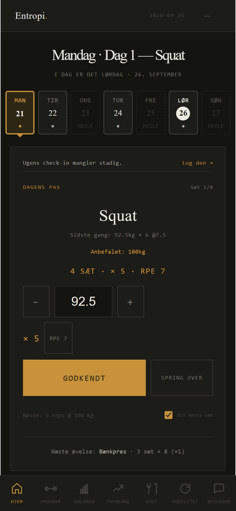
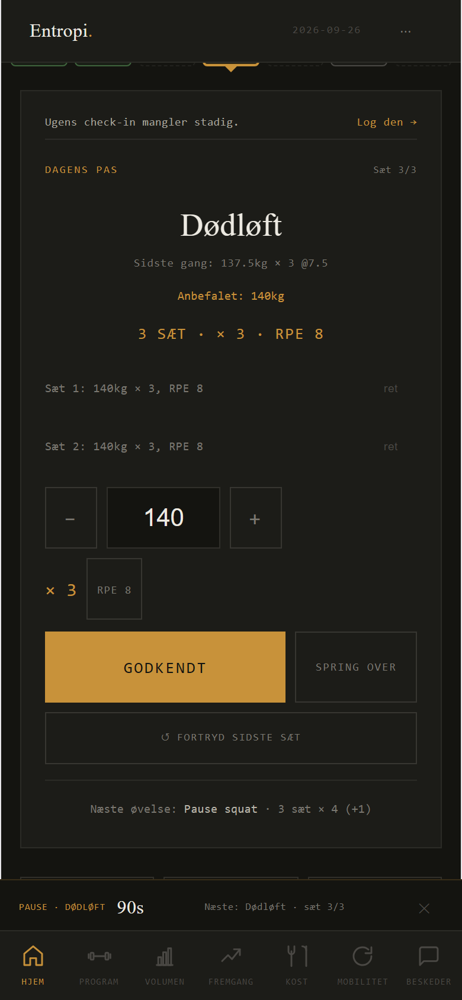
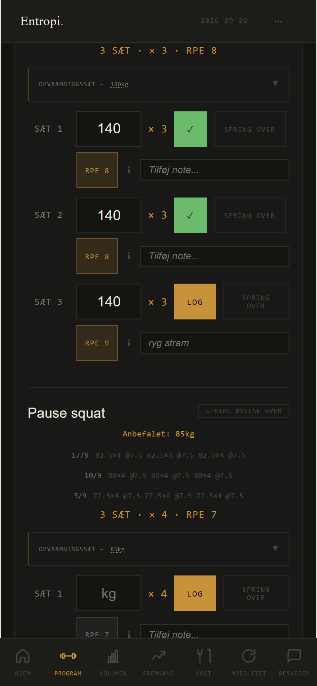
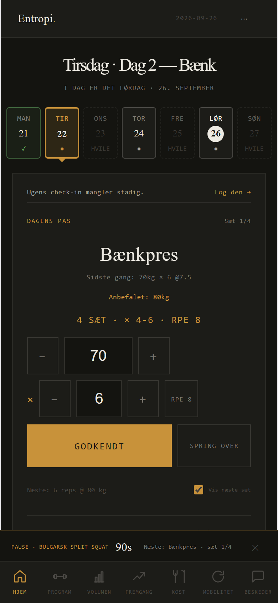
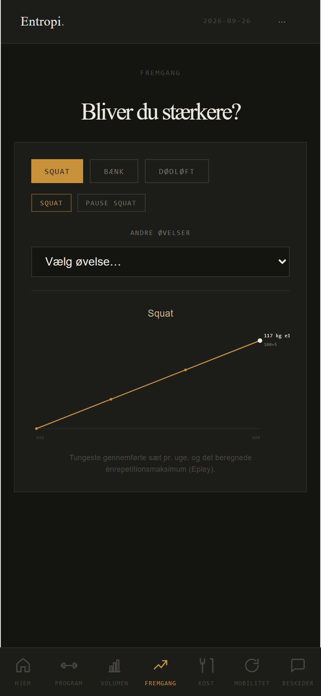
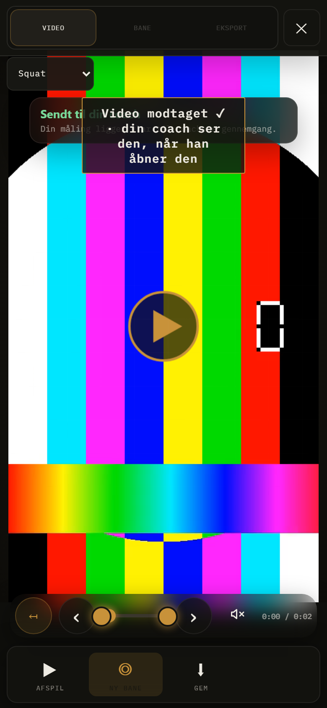

# En uge som atlet på telefonen (ordre 419, blok 1)

Målt headless i Chromium, 390 × 844, touch og iPhone-UA, mod e2e-mocken. Atleten er
syntetisk (Testatlet fra `e2e/fixtures.mjs`). Ugen har 4 pas: Dag 1 squat, Dag 2 bænk,
Dag 3 dødløft og Dag 4 volumen, hvert med tilbehør. Dertil kommer tre forgangne uger
med logget historik, så "Sidste gang", Fremgang og Volumen har noget at vise. Coachen
har sat "Anbefalet" på hovedløftene, og tilbehøret har ingen anbefaling.

Script: `node outputs/419/uge.mjs` (fælles opsætning i `outputs/419/uge-faelles.mjs`).
Billeder og tal fra kørslen ligger i `outputs/419/foer/`, og tallene står i `maaling.json`.

**Sådan er der talt.** Et tryk er et klik, et valg eller at vælge et felt. Står målet
ikke synligt over bundnavigationen, tælles også en rulning. Tegn tælles for sig.
Maskintiden er tiden fra klik til næste tilstand i appen. Den anslåede tid for et
menneske er ikke målt, men regnet: 1,2 s pr. tryk, 1,5 s pr. rulning og 0,3 s pr. tegn.
Den er med, så afsnittene kan sammenlignes.

**Atletens regel.** Står der "Anbefalet: X kg" fra coachen, løfter atleten X kg. Står
feltet på noget andet, trykker atleten +/− til tallet passer.

## Ugen, målt

| Afsnit | Tryk | Rul | Tegn | Maskine | Anslået |
|---|---|---|---|---|---|
| Log ind | 3 | 0 | 28 | 2,6 s | ~12 s |
| Pas 1, squat: log alle sæt, fortryd sæt 3 og log det igen | 15 | 0 | 0 | 8,2 s | ~18 s |
| Pas 2, bænk: ret sæt 1, spring sæt 4 over | 18 | 0 | 0 | 7,2 s | ~22 s |
| Pas 3, dødløft: RPE 9 og en note på sæt 3 | 17 | 1 | 9 | 10,2 s | ~25 s |
| Pas 4, volumen: log alt, giv passet en vurdering | 16 | 1 | 0 | 10,6 s | ~21 s |
| Historik: sidste uges Dag 1 | 3 | 1 | 0 | 1,7 s | ~5 s |
| Fremskridt: Fremgang-fanen | 1 | 0 | 0 | 1,9 s | ~1 s |
| Video: vælg, vælg løft, send | 6 | 1 | 0 | 1,6 s | ~9 s |
| **Ugen** | **79** | **4** | **37** | | |

Alle 38 sæt endte som én række hver i mocken (1 sprunget over, 1 med note og RPE 9).
Der var ingen konsolfejl. "Godkendt" gik videre til næste sæt på 16–116 ms, så hastigheden
er ikke problemet. Det er de små ting nedenfor.

## De fem største irritationer

### I1. Vægtfeltet starter på "sidste gang", ikke på coachens "Anbefalet"

Kortet siger "Anbefalet: 100kg" og "Næste: 5 reps @ 100 kg", men feltet står på 92.5.
"Sidste gang" er det seneste pas med øvelsen. For squat er det lørdagens lette
volumenpas (92,5 × 6), ikke sidste mandag. Det skete ved første sæt af hvert hovedløft
med anbefaling, 7 af 7 gange i ugen.
- **Målt:** 11 ekstra tryk på +/− om ugen (3 + 4 + 2 + 2), ca. 13 s. Efter første sæt
  arver næste sæt atletens egen vægt, så det sker én gang pr. øvelse.
- **Værre end trykkene:** Stoler atleten på feltet og trykker Godkendt, gemmes 92,5 kg,
  selv om der blev løftet 100. Coachen ser et forkert tal.
- **Forslag:** Har coachen sat en anbefalet vægt på øvelsen, står feltet på den. Ellers
  bruges sidste gang som nu. "Sidste gang"-linjen bliver stående som information.

### I2. RPE og note kan ikke sættes i Dagens pas; RPE-boksen ligner en knap, men er død
 

Boksen "RPE 8" ved siden af reps er 52 px høj med ramme, præcis som knapperne omkring
den. Et tryk gør intet. Uden et valg gemmes den planlagte RPE som den faktiske, så
coachen ser "RPE 8", også når sættet var en 9'er. Vil atleten skrive den rigtige RPE og
en note, skal atleten forlade Dagens pas. Vejen er Program, åbn Dag 3, find sæt 3, vælg
RPE, vælg 9, skriv en note, tryk Log og gå tilbage til Hjem.
- **Målt:** 1 dødt tryk, derefter 7 tryk, 1 rulning og 9 tegn, 4,2 s maskintid (~13 s
  anslået). Dertil skal atleten selv finde det rigtige sæt i en lang liste.
- **Forslag:** RPE-boksen bliver en knap, der åbner en lille række med RPE 6–10 i
  halve trin på selve kortet. Et lille "+ note"-felt kommer under den. Begge fylder de
  samme felter (`rpe`, `note`), som Godkendt allerede gemmer. Intet nyt i data.

### I3. Passet slutter uden at spørge, hvordan det gik; vurderingen ligger gemt i Program

Efter sidste sæt i pas 1 skifter kortet direkte til "Tirsdag · Dag 2 — Bænk". Atleten
bliver aldrig spurgt, hvordan passet gik. "Træningsfeedback" (1–5 og en kommentar)
findes kun nederst i passet i Program-fanen, under alle sæt.
- **Målt:** 4 tryk og 1 rulning (Program, åbn passet, rul ned, 4, Gem), 3,2 s maskintid
  (~6 s anslået). Tallet er lavt, men atleten skal selv vide, at det findes. I målingen
  blev det kun fundet, fordi scriptet ledte efter det.
- **Forslag:** Når sidste sæt i et pas er logget fra Dagens pas, viser kortet én linje
  øverst: "Hvordan gik Dag 1? 1 2 3 4 5" og "Spring over". Et tryk gemmer vurderingen
  samme vej som Program-fanen (`athlete_rating`), og linjen forsvinder. Det bliver 1 tryk
  uden rulning. Kommentaren bliver i Program.

### I4. Fremgang: tallet, man leder efter, er lille og skåret af

Kurven viser e1RM pr. uge. Det eneste tal står øverst til højre med ca. 7 px skrift og
er skåret over ved grafens kant ("117 kg e1"). Der står ingen ændring, fx "+7 kg på 4
uger", og startpunktet har ikke noget tal.
- **Målt:** 1 tryk til fanen. Tallet kan ikke læses på armslængde i billedet i 390 px.
- **Forslag:** En linje over grafen i normal størrelse: "Squat e1RM 117 kg · +7 kg siden
  uge 36". Etiketten skal holdes inden for grafen.

### I5. Video: to kvitteringer oven i hinanden, ingen af dem kan læses

Efter "Send" i VideoCoach står det grønne "Sendt til din coach …" og "Video modtaget ✓ ·
din coach ser den, når han åbner den" oven i hinanden midt på videoen.
- **Målt:** 6 tryk fra Fremgang-fanen til sendt (Hjem, Mere, VideoCoach, vælg video, vælg
  løft, Send). Trykkene er fine. Beskeden, der skal berolige atleten, kan ikke læses.
- **Forslag:** Kun én kvittering. Behold "Video modtaget ✓ …" og skjul det grønne banner,
  når atleten har sendt. `videocoach.html` er selvstændig, så rettelsen hører til en
  VideoCoach-ordre.

## Også set (mindre)
- **Ret-panelet** ("vis / ret" og "Ret sæt 1") brækker midt i reps-kontrollerne i 390 px:
  "−" står på første linje og feltet på anden (`outputs/419/foer/06-pas2-ret.png`). Det
  er samme fejl, som ordre 314 rettede på selve kortet. At rette et tal tog 4 tryk.
- **Pauselinjen** fortsætter efter sidste sæt i et pas og efter ugens sidste sæt
  ("Pause · Pull-ups 90s" under "Passet er færdigt"), se `11-pas4-faerdig.png`.
- **"Vis / ret" bliver stående foldet ud** på tværs af øvelser og pas, når atleten
  først har åbnet den (`08-pas3-rpe-paa-kortet.png`).

## Rækkefølge

Irritationerne er rangeret efter hyppighed × pris. I1 rammer hvert pas og kan gemme et
forkert tal. I2 rammer hver gang et sæt ikke gik som planlagt, og den planlagte RPE
gemmes stille. I3 rammer hvert pas, og coachen mister vurderingen. I4 og I5 rammer en
gang imellem. Blok 2 retter I1–I3.

## Blok 2: I1–I3 rettet, målt før og efter

Samme script og samme uge. Før er `outputs/419/foer/`, efter er `outputs/419/efter/`
(`node outputs/419/uge.mjs` med `UGE_UD`). Intet er ændret i skemaet, i hvad der gemmes
pr. sæt eller i coachens visning.

| Afsnit | Tryk før → efter | Rul før → efter | Anslået før → efter | Maskine før → efter |
|---|---|---|---|---|
| Pas 1, squat | 15 → 12 | 0 → 0 | ~18 s → ~14 s | 8,2 s → 8,1 s |
| Pas 2, bænk | 18 → 14 | 0 → 0 | ~22 s → ~17 s | 7,2 s → 7,1 s |
| Pas 3, dødløft med RPE og note | 17 → 11 | 1 → 0 | ~25 s → ~16 s | 10,2 s → 6,4 s |
| Pas 4, volumen med vurdering | 16 → 11 | 1 → 0 | ~21 s → ~13 s | 10,6 s → 8,3 s |
| **Ugen** (alle afsnit) | **79 → 61** | **4 → 1** | **~112 s → ~86 s** | |

Log ind, historik, Fremgang og video er uændrede (3, 3, 1 og 6 tryk). Historikken gik
fra 1 til 0 rulninger, men kun fordi forrige afsnit ikke længere slutter nede i
Program-fanen. Det skyldes ikke en rettelse.

**I1, vægten.** `src/setLogDefaults.js`: `defaultSetWeight` har fået `coachWeight`, som
vinder over sidste gang. Rækkefølgen er nu tastet, coachens anbefalede, sidste gang og
til sidst appens forslag. `DagensPasCard.jsx` giver `ex.recommended_weight` som
`coachWeight`. Resultatet: +/−-tryk for at nå den anbefalede vægt faldt fra 11 til 0
om ugen, og alle 7 første sæt stod på det anbefalede tal
(`outputs/419/efter/02-pas1-foer-justering.png`: 100, ikke 92.5). Øvelser uden
anbefaling bruger sidste gang som før. `e2e/dagens-pas-historik.spec.mjs` låste den
gamle rækkefølge (95 før coachens 80) og er rettet til 80. Den viser stadig, at
forudfyldningen kører igen, når historikken kommer, via reps (4 → 5).

**I2, RPE og note på kortet.** RPE-boksen er nu en knap (`RPE 8 ▾`), der åbner en række
med RPE 5,5–10, samme skala som Program-fanen. "+ note" i vægtrækken åbner et notefelt,
der får fokus. Begge skriver i sættets `logInputs` (`rpe`, `note`), som Godkendt
allerede gemte. Uden valg gemmes den planlagte RPE som før. Resultatet: 1 dødt tryk + 7
tryk + 1 rulning blev til 4 tryk (RPE, 9, + note, Godkendt), og atleten forlader ikke
Dagens pas (`efter/09-pas3-rpe-note.png`). Mocken har `note: "ryg stram", rpe_actual: 9`
på sæt 3 i begge kørsler.

**I3, vurderingen.** Når sidste sæt i et pas er logget fra kortet, og passet ikke har en
vurdering, står "Dag 1 — Squat er klaret. Hvordan gik det? 1 2 3 4 5 · spring over"
øverst på kortet (`efter/05-pas1-faerdig.png`, `efter/11-pas4-faerdig.png`). Et tryk
kalder `saveFeedback(id, { rating })` (`saetSkrivning.js`, samme skrivning af
`athlete_rating` som Program-fanen). Fejler den, bliver linjen stående, og den kendte
fejlbesked vises. Linjen forsvinder, når atleten logger første sæt i næste pas. Resultatet:
4 tryk + 1 rulning blev til 1 tryk, og mocken har `athlete_rating: 4` på Dag 4.
Kommentarfeltet er stadig kun i Program.

**Fanget undervejs.** Den første udgave satte "+ note" i reps-rækken. Ved 360 px brækkede
det rækken, og `e2e:rolig-forside` gik rød (chips-bund 805 over folden 780). Knappen står
nu i vægtrækken, og chips-bunden er 745 som på main.
