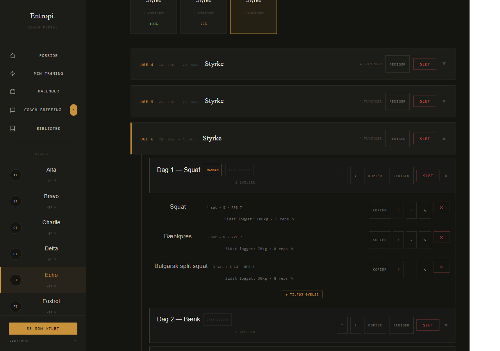
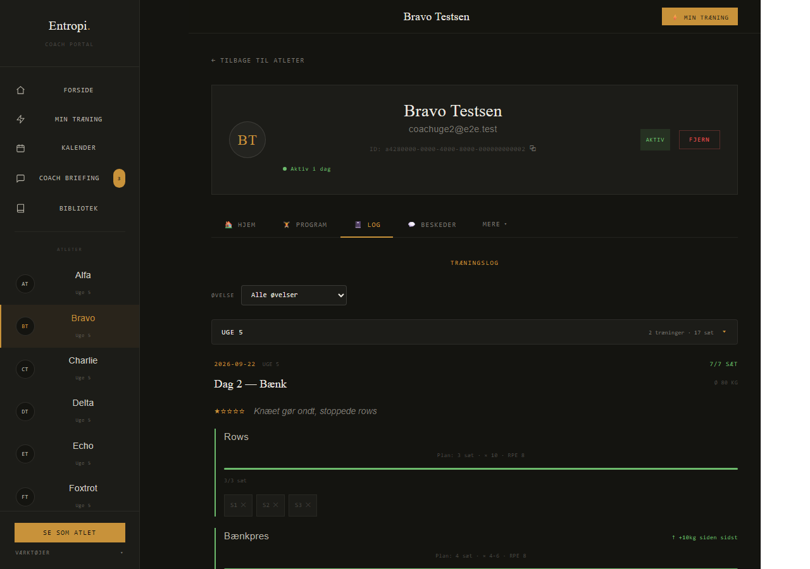
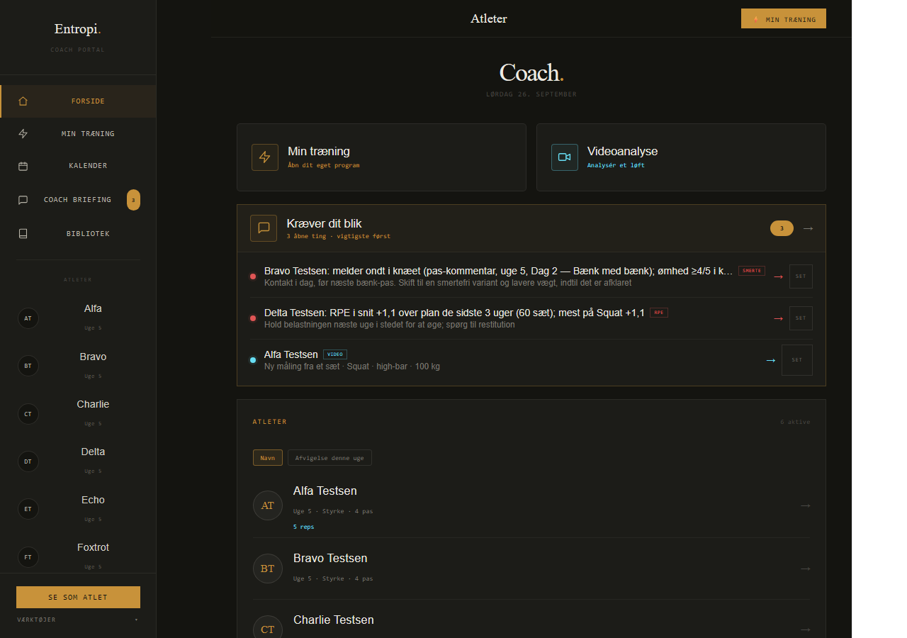
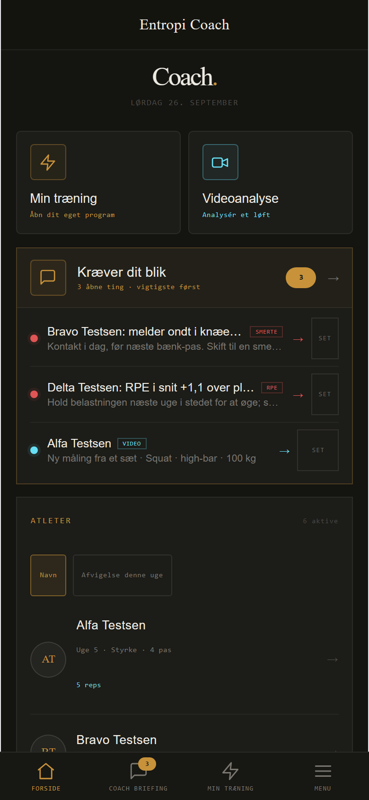

# En uge som coach på computeren (ordre 428, blok 1)

Målt headless i Chromium mod e2e-mocken, 1280 px (og 390 px for det Marc gør
på telefonen). En syntetisk coach og 6 syntetiske atleter (Alfa-Foxtrot
Testsen, opdigtede) med en realistisk uge: sidste uge fuldt logget, denne uge
blandet. Alfa har gennemført alt og sendt en video. Bravo har 2 af 4 pas, har
sprunget rows over og skrevet "Knæet gør ondt". Charlie har ikke trænet. Delta
har gennemført alt, men med RPE 2 over planen. Echo har 3 af 4 pas med
vurdering 5, og Foxtrot har 1 pas. Træningssignalerne (smerte, RPE-drift)
regnes med appens eget JS-spejl af SQL-reglerne (`detectSignalsV2`), fordi
mocken ikke har Postgres-funktionen.

Kommando: `node outputs/428/verify-428.mjs --blok 1` (tal i
`outputs/428/foer/maaling.json`, billeder i `outputs/428/foer/`). Klik er
rigtige klik i scriptet. Enter tæller som et klik. Tiden er maskintid
(klik til næste tilstand) og ikke menneskelig tid. Et menneske læser og
tænker oven i det.

## Ugen i overblik

| Det Marc gør | Klik | Maskintid | Hvad der gik godt |
|---|---|---|---|
| Logge ind, se "Kræver dit blik" | 0 | | Smerte (Bravo), RPE-drift (Delta) og videoen (Alfa) står øverst i den rigtige rækkefølge |
| Se hvem der har trænet | 1 | 0,8 s | "Afvigelse denne uge" sorterer Charlie øverst ("0 sæt · 8d siden") |
| Læse ugens RPE, noter og vurderinger for alle 6 | 15 | 11,2 s | Log-fanen er god, når man først er der: plan mod faktisk RPE pr. sæt, stjerner og kommentar |
| Se en video | 1 | | Et klik på punktet åbner VideoCoach med klippet |
| Kopiere og rette næste uge for **en** atlet | 32 (+22 tegn) | 13,0 s | "Kopiér seneste uge" laver ugen med ét klik |

"Send": der er ingen særskilt send-knap. En uge atleten kan se, er sendt, når
den er oprettet. "Generér næste uge" kalder edge-funktionen `draft-next-week`,
som mocken ikke har, så den kunne ikke måles offline (den svarer `not-found`).

## C1. "Kopiér seneste uge" taber vægtene og ugedagene (32 klik pr. atlet)

`outputs/428/foer/C1-efter-kopi-dag1-1280.png` og `outputs/428/foer/C1-uge6-faerdig-1280.png`

Opgaven er Marcs normale mandag: næste uge skal være som denne, med squat og
dødløft +2,5 kg. Kopien (`copyWeek` i `programHandlinger.js`) tager navn, sæt,
reps og RPE med, men ikke `recommended_weight` og ikke `weekday`. Alle 7
anbefalede vægte står derfor tomme ("Sidst logget: 100kg × 5 reps ✎"), og alle
4 pas har mistet deres ugedag, så atletens ugestrimmel ikke ved hvornår passene
ligger. For at få ugen tilbage skal Marc bruge **32 klik og 22 tegn for én
atlet**: 4 × (Rediger, ugedag, Gem), 4 × fold passet ud og 7 × (klik vægt,
skriv, Enter). De 5 vægte, der skulle være uændrede, skal også skrives igen.
For 6 atleter er det omkring 190 klik om ugen.

**Forslag:** kopien tager `recommended_weight` og `weekday` med. Så koster
opgaven kopi + fold to pas ud + to vægte = 8 klik, og kun det, der faktisk
ændres.

## C2. Ugens stemme ligger tre klik inde pr. atlet (15 klik)

`outputs/428/foer/C2-log-bravo-1280.png` og `outputs/428/foer/C2-forside-efter-runden-1280.png`

Atleterne sender nu vurderinger (1-5), pas-kommentarer og sæt-noter. Intet af
det står på forsiden. For hver atlet skal Marc åbne profilen (den åbner på
Program), klikke Log og gå tilbage: **15 klik og 11 s maskintid** for 5 atleter.
Charlie har intet at læse, men det ved Marc først, når han har kigget. "Kræver
dit blik" fanger kun kommentarer med smerteord (Bravo). Deltas "Alt var tungt,
sov dårligt" og Echos vurdering 5 ser han først inde i loggen.

**Forslag:** atletrækken på forsiden viser ugens laveste vurdering og den
nyeste kommentar eller note, fx "★ 1/5 · Knæet gør ondt, stoppede rows". Et
klik på linjen åbner Log direkte.

## C3. Hvem har trænet? Kun bag en knap, og kg-tallene passer ikke (1 klik, forkert tal)

`outputs/428/foer/C3-forside-1280.png` og `outputs/428/foer/C3-afvigelse-1280.png`

Standardvisningen viser "Uge 5 · Styrke · 4 pas" for alle 6. Det er identisk
for den, der har trænet alt, og den, der intet har lavet. Først efter et klik
på "Afvigelse denne uge" står tallene, og de er forkerte. Alfa, der har lavet
præcis planen, står som "Planlagt 30 sæt · 2180 kg — gennemført 30 sæt ·
12160 kg" (5,6 gange planen). Planlagt kg er regnet som sæt × vægt (uden reps)
og kun for øvelser med anbefalet vægt. Gennemført kg er vægt × reps for alle
øvelser. De to tal kan ikke sammenlignes, og sorteringen bruger dem.

**Forslag:** vis ugens status i standardlinjen ("2 af 4 pas · 4d siden").
Regn planlagt kg som sæt × reps × vægt, og gennemført kg kun på de samme
øvelser, så en fuldført plan giver samme tal.

## C4. Log viser en sprunget øvelse som gennemført

`outputs/428/foer/C4-log-dag2-1280.png`

Bravo sprang rows over (3 sæt, ✕) på grund af knæet. Loggen skriver "7/7 SÆT"
i grønt på passet og "3/3 sæt" med fuld grøn bjælke på rows. Marc skal se de
små ✕ for at opdage, at øvelsen ikke blev lavet. 2 klik for at komme dertil,
men tallet vildleder.

**Forslag:** tæl sprungne sæt for sig: "4/7 sæt · 3 sprunget over" og "0/3 sæt
· sprunget over", uden grøn bjælke.

## C5. Telefonen: "Kræver dit blik" klipper det vigtigste af

`outputs/428/foer/C5-telefon-forside-390.png`

På 390 px er overskrift og handling én linje hver med "…". Af smerteoverskriften
"Bravo Testsen: melder ondt i knæet (pas-kommentar, uge 5, …)" kan 29 % læses,
og af handlingen 54 %. Af RPE-overskriften kan 46 % læses. "Hvad er der sket"
kræver et klik ind (0 klik for at se punktet, men det kan ikke læses).

**Forslag:** lad overskrift og handling bryde over to linjer på telefonen
(`-webkit-line-clamp: 2`) i stedet for én linje med ellipse.

## Rangering

C1 koster flest klik hver uge (omkring 190 for 6 atleter), og fejlen rammer
også atleten (ugedagene forsvinder). C2 er den daglige læsning, som de nye
atletdata skulle gøre værdifuld. C3 er forsidens første spørgsmål, og tallet
er forkert. C4 og C5 er ægte, men de koster mindre og rammer færre gange.
Blok 2 retter C1-C3.
