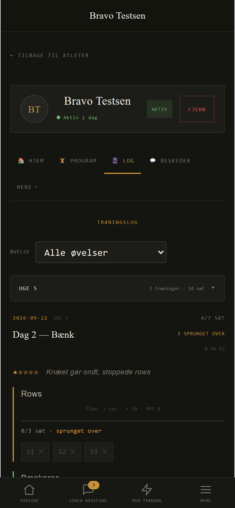
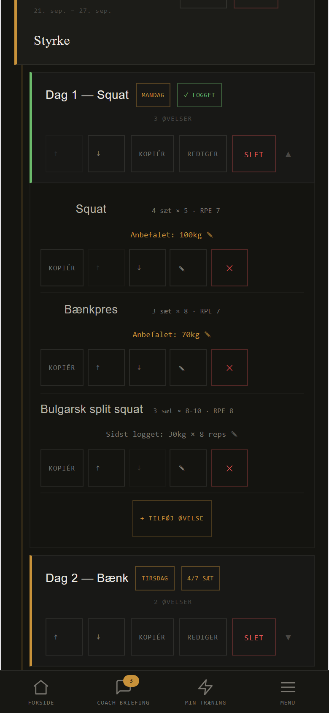

Ordre 433

# Coachens uge del 2: Log tæller sprungne sæt for sig, "Kræver dit blik" kan læses på telefonen, og coachen kan bruge telefonen uden at zoome

Alle mål er taget headless i Chromium ved 390 × 844 (telefon) og 1280 × 900 mod e2e-mocken
med den syntetiske coach og de 6 syntetiske atleter fra 428 (`outputs/428/coach-faelles.mjs`,
Alfa-Foxtrot Testsen). Der er ingen atletdata og ingen kald mod prod.

## Gren

`coachens-uge-2` fra `main` (`59afda2`, 428 merget). Grenen er ikke pushet.
- blok 1: `d3d0754` C4 og C5, før/efter på 390 og 1280 px
- blok 2: `c293cc4` coachen på telefonen, tre steder rettet
- blok 3: commit efter `c293cc4` med build, offline-bevis, VideoCoach-test og denne rapport

Én verificeringskommando pr. blok: `node outputs/433/verify-433.mjs --blok 1|2|3`. Før-målingen
tages med `--foer` på koden fra før rettelsen (`git stash`).

## Hvad ændret

**Blok 1: C4 og C5** (`src/dashboard/LogTab.jsx`, `src/dashboard/ForsideView.jsx`)

- **C4:** Log tæller et sprunget sæt som sprunget, ikke som lavet. Passet viser "4/7 SÆT" og
  under det "3 SPRUNGET OVER" i ravgult. Øvelsen viser "0/3 sæt · sprunget over" uden grøn
  bjælke og med ravgul i stedet for grøn kant. Ugens sum i Log tæller heller ikke sprungne
  sæt med (Bravos uge 5: 14 sæt, før 17).
- **C5:** På telefonen brydes overskrift og handling i "Kræver dit blik" over to linjer
  (`-webkit-line-clamp: 2`) i stedet for én linje med "…". Computeren er uændret.

| C4 Log, Bravo dag 2 | Før | Efter |
|---|---|---|
| 390 og 1280 px | "7/7 SÆT", Rows "3/3 sæt", grøn bjælke | "4/7 SÆT · 3 SPRUNGET OVER", Rows "0/3 sæt · sprunget over", ingen bjælke |

| C5, 390 px | Før: overskrift / handling synlig | Efter |
|---|---|---|
| Bravo: melder ondt i knæet | 29 % / 54 % | 49 % / 100 % |
| Delta: RPE over plan | 46 % / 79 % | 65 % / 100 % |
| Alfa: video | 100 % / 100 % | 100 % / 100 % |

Hvem og hvad (teksten før kilde-parentesen) kan nu læses i alle tre punkter, og handlingen kan
læses helt. Tabellerne står i `outputs/433/efter/foer-efter-blok1.md`, billederne i
`outputs/433/foer/` og `outputs/433/efter/`.

**Blok 2: coachen på telefonen** (390 px: forsiden, Bravos uge, Log, en kommentar via "ugens
stemme", en video). Der var ingen sidelæns rulning på nogen skærm. De tre steder, hvor coachen
måtte zoome eller ikke kunne ramme:

| Sted (390 px) | Før | Efter |
|---|---|---|
| 1. Program, en uge: pas-titlen klemt af fem knapper | titel 40 px bred, 167 px høj ("Dag 1 / — / Squat"), ↑ ↓ 25 px brede | titel 302 af 338 px, én linje; knapperne under; ↑ ↓ ✎ ✕ mindst 44 px |
| 2. Log: sæt og atletens note på sættet | 8,6 px, noten mørkegrå på mørk | 11,5 px, noten lysere |
| 3. Forsiden: "ugens stemme" (★ 3/5) og måling (5 reps) | 24-26 px brede at trykke på | mindst 64 × 32 px |

Blyanten til at omdøbe en blok (15 px) er også gjort 44 px bred. Alt er rettet med `isMobile`
i coachens komponenter (`ProgramTab.jsx`, `LogTab.jsx`, `ForsideView.jsx`, og `Dashboard.jsx`
giver `isMobile` videre til Log). Computeren er uændret, og atletens sider og VideoCoach er
ikke rørt. Tabellen står i `outputs/433/efter/foer-efter-blok2.md`.

## Testresultat

- `node outputs/433/verify-433.mjs --blok 1`: GRØN (C4 på 390 og 1280, C5-krav, 0 konsolfejl).
- `node outputs/433/verify-433.mjs --blok 2`: GRØN (ingen sidelæns rul, titelbredde, knapper
  ≥ 44 px, Log-tekst ≥ 11 px, forsideknapper ≥ 64 × 32 px, 0 konsolfejl).
- `npm run lint`: grøn.
- `verify:coach-priority`, `verify:coach-inbox-flow`, `verify:mandagsrunden-tilstande`,
  `verify:progression-state`, `e2e:coach-afvigelse`, `e2e:coach-mandagsrunden`,
  `e2e:rolig-forside` og hele `npm run e2e` (atlet → coach, ende-til-ende): grønne
  (`outputs/433/koersel-*.txt`).
- `node outputs/433/verify-433.mjs --blok 3`: lint, `npm run build`, offline-beviset
  (`outputs/414/offline-bevis.mjs` med `BEVIS_UD=outputs/433/offline-bevis`) og
  VideoCoach-testene upload-flow, submission, buttons-layout, upload, labels, film-guide, zoom
  og clip: grønne (`outputs/433/koersel-*.txt`).
- `verify:videocoach-clip` er ustabil på denne maskine. Den var rød i 3 af 9 kørsler
  ("Vis mig nu" tog 1,11x sin varighed mod grænsen 1,1x) og grøn i de andre (1,06-1,08x). Den
  var rød, mens andre tests kørte. VideoCoach er ikke rørt i denne ordre, så det er maskintid
  og ikke en regression.

## Hvad er næste

**Det Marc kan mærke efter push:**

- Log siger ærligt "4/7 sæt · 3 sprunget over"; en sprunget øvelse er ikke længere grøn.
- På telefonen kan "Kræver dit blik" læses: hvem, hvad og hele handlingen.
- På telefonen står pas-titlen på én linje, knapperne kan rammes, og sæt og noter i Log
  kan læses uden at zoome.

**Næste skridt:** VideoCoach' øverste bjælke på 390 px (faner, → og ✕ overlapper
hjælpeteksten, og "⏸ PA…" står klippet i højre kant) er den fjerde ting, coachen støder på.
Den ligger i `public/videocoach.html` og er ikke rørt her.

**Persondata fundet og fjernet:** 428's `outputs/428/koersel-videocoach-clip.txt` indeholdt
ffmpeg-metadata fra Marcs egen testvideo (`test-clips/marc-doedloeft-270.mov`): GPS-position,
telefonmodel og optagetidspunkt. Filen er slettet på denne gren, og `verify-433.mjs` fjerner
nu den slags linjer, før en log skrives. Filen ligger stadig i historikken (`9ae2def`, merget
til main). Hvis main er pushet til det offentlige repo, skal Marc tage stilling til, om
historikken skal renses.

**For Hara** (Coaching, delmål "Appen mærkbart bedre"): coachen ser nu, når en atlet springer
en øvelse over (fx på grund af smerte), i stedet for et grønt "gennemført". Marc kan læse
atletens noter og kommentarer på telefonen uden at zoome. Det gør atleternes data mere nyttige.

## Ærlige grænser

- "Zoome" er målt som tekst under 10 px og "ikke kan trykke" som trykflader under 32 px (krav
  44 px bredde for de rettede). Det er maskinmål, ikke en person med en telefon.
- Appens små mono-etiketter (7-9 px: bundmenuen, "UGE 5", "Plan: …") er stadig små. De er
  en del af designet, og der er ikke rørt ved dem. Kun Log, som coachen skal kunne læse, er
  gjort større.
- "Set" i "Kræver dit blik" er 30 × 44 px og er ikke ændret.
- Overskriften i C5 kan stadig blive klippet efter to linjer, når den er lang (Bravos kilde-
  parentes, 49 % synlig). Det var ordrens valg. Hele teksten står stadig bag et klik.
- VideoCoach er kun målt fra appens side (ingen sidelæns rul). Selve værktøjet i iframen er
  ikke rettet (se næste skridt).
- Programredigering (formularer, ny uge) på telefon er ikke målt; turen dækker at se en uge
  og åbne et pas.
- Mocken svarer [] på `entropi_training_signals_v1`, så signalerne regnes med appens JS-spejl
  som i 428.
