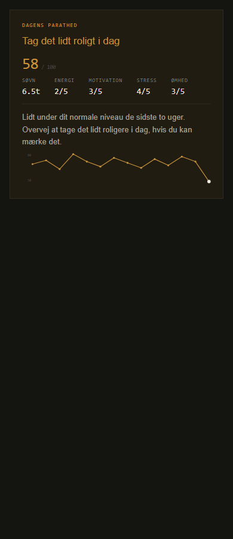

# ORDRE 100 — Parathed der svarer igen

## 1. Gren + commits

Gren: `parathed-svarer-igen` (fra `main` — startet på `9416aed`, én commit
foran den `7b9e9f4` ordren navngav; kun en dokumentations-commit fra ordre
85's aflevering imellem, ingen konflikt).

- `23ce00f` — commit 1: dagens score op mod atletens eget 14-dages-snit
  (linje under formularen)
- `6dfd214` — commit 2: 14-dages kurve under linjen
- `b4b5548` — commit 3: enhedstest af sammenligningen og teksterne

## 2. Hvad blev ændret

**Ny fil `src/readinessInsight.js`** — ren sammenligningslogik, adskilt fra
`AthleteView.jsx` så den kan enhedstestes uden en mountet komponent (samme
mønster som `readinessDraft.js`):

- `compareReadiness(todayScore, historyScores)` — under/som/over sat ud fra
  spredningen i atletens egen historik: tærsklen er 0,5 × standardafvigelsen
  af de foregående (op til 14) dages score. Er historikken helt flad (ingen
  spredning) falder den tilbage til et fast 3-points tærskelpunkt, så en
  helt stabil atlet ikke får "under"/"over" af rene afrundingsudsving. Under
  fem foregående logs → status `insufficient`.
- `readinessComparisonText(status)` — de tre citerede varianter fra ordren
  ordret ("Lidt under dit normale niveau de sidste to uger." / "Som du
  plejer." / "Over dit normale.") plus insufficient-teksten.
- `readinessTrainingNote(status)` — én ekstra sætning om dagens træning,
  ingen programændring, intet medicinsk råd. `null` ved insufficient (der er
  intet at sige noget om endnu).

**`src/AthleteView.jsx`:**

- `fetchReadiness` henter nu også op til 14 forudgående dages
  `readiness_score` (samme tabel `readiness_logs`, ny `logged_date < i dag`-
  forespørgsel, ingen ny tabel/kolonne) → ny state `readinessHistory`.
- Den allerede-gemt-parathed-visning (vises kun for dagens egen log) får en
  ny linje under felt-gitteret: sammenlignings-sætningen +
  træningsnoten, i samme afsnit ("Lidt under dit normale niveau de sidste to
  uger. Overvej at tage det lidt roligere i dag, hvis du kan mærke det.").
- Ny komponent `ReadinessSparkline({ points })` (samme fil, ved siden af
  `E1RMChart`) — én SVG-linje, kun min/max som talte akse-labels (intet
  dato-tal-akse), samme farve/prik-stil som de øvrige grafer i filen.
  Punkterne er historikken + dagens egen score, op til 14 i alt. Renderes
  udelukkende inde i dagens-log-kortet — der er intet andet sted i appen
  parathed vises som tidslinje, så "foldet ud som standard, kun dér" er
  opfyldt uden en fold/kollaps-mekanik.
- Ingen nye trykflader tilføjet (kurven er ren visning, ingen `onClick`) →
  44px-kravet er automatisk opfyldt (der er ingen at måle).

## 3. Testresultat

- `node --test src/*.test.js` — **95/95 grønne**, heraf **10 nye** i
  `src/readinessInsight.test.js`: færre end fem logs, ingen logs, præcis
  fem, en meget stabil atlet (lille spredning → små afvigelser slår ud),
  en atlet med stor spredning (samme afvigelse forbliver "som du plejer"),
  dagens score som tydelig outlier (begge retninger), nul-spredning-
  fallback, grænsetilfælde ved præcis tærsklen, samt de fire tekstvarianter
  og at træningsnoten aldrig nævner læge/medicin.
- `npm run lint` — **0 fejl**, 13 præeksisterende `react-hooks/exhaustive-
  deps`-advarsler (uændrede, ikke rørt af denne ordre).
- `npm run gate:tracker` — **GRØN** (alle 8 GATE-rigge OK, tracker-koden er
  ikke rørt af denne ordre).
- **Ingen levende Supabase-test** — samme grænse som altid: lokal dev peger
  på produktion, der er ikke oprettet en testkonto. `fetchReadiness`s nye
  historik-forespørgsel er derfor ikke set køre mod en rigtig atlets rigtige
  data, kun mod syntetisk input i enhedstestene og i skærmbilledet nedenfor.

**Skærmbillede, 390 px, ingen vandret scroll** (headless Chrome,
`--screenshot`, en midlertidig ikke-committet preview-harness der genbrugte
de nøjagtige style-værdier og JSX-strukturen fra `AthleteView.jsx` med
syntetisk indhold — samme metode som ordre 41/68/70; sammenlignings-teksten
i billedet er selve `compareReadiness`s ægte output for de viste tal, ikke
gættet. Harnesset er slettet efter brug):

## 4. Hvad er næste

- Kun set i preview-harness, ikke i en rigtig, indlogget atlet-session (se
  "Ærlige grænser"). Første rigtige bekræftelse kommer den dag en atlet
  logger parathed fem+ dage i træk i produktion.
- Tærsklen (0,5 × sd, 3-points fallback) er et fornuftigt, testet, men
  ikke Marc-godkendt tal — hvis linjen i praksis føles for følsom eller for
  doven, er det ét tal at justere i `readinessInsight.js`, ikke en
  omskrivning.
- Ingen af de øvrige F/G-fund fra ordre 41 er rørt af denne ordre.

## 5. Ærlige grænser

- Ingen levende Supabase-test af `fetchReadiness`s nye historik-hentning
  (se afsnit 3) — kun enhedstestet ren logik + syntetisk preview.
- Sammenlignings-vinduet er "op til 14 forudgående dage", ikke nødvendigvis
  14 sammenhængende kalenderdage — en atlet der springer dage over får et
  vindue der strækker sig længere tilbage i tid. Samme tilgang som appens
  øvrige "sidste N logs"-grafer (kropsvægt, e1RM), ikke en ny svaghed.
  "Kurven" (op til 14 punkter) kan derfor dække et andet tidsrum end
  "snittet" den sammenlignes mod, hvis atleten har huller i loggen — begge
  bruger uafhængigt "op til 14 forudgående/seneste punkter", ikke et fælles
  kalenderinterval.
- Tærsklen er min fortolkning af "spredningen i atletens egne data" — ordren
  angiver ikke et præcist multiplum. 0,5 × sd er en midt-imellem-værdi (ikke
  for følsom, ikke for doven); valgt og noteret, ikke spurgt blokerende om.
- "Under fem logs" er fortolket som fem foregående dage (ikke inkl. dagens
  egen log) — samme tvetydighed, samme fremgangsmåde: valgt og noteret.
